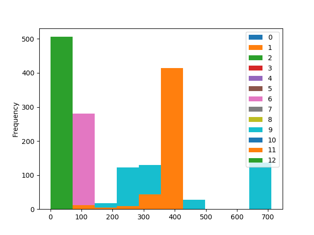
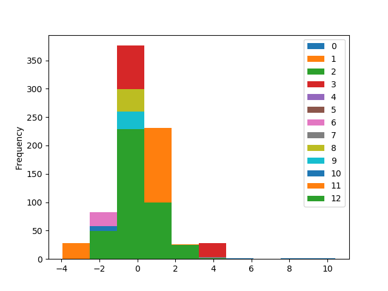
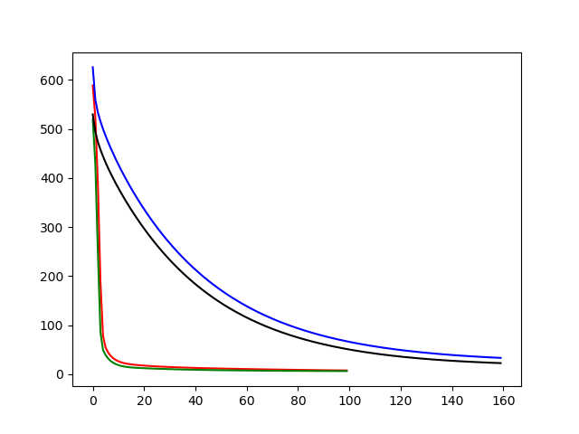

# House-Pricing-API
Machine Learning based house pricing and REST API

Boston house price predictions are obtained using feedforward neural network and support vector regressor

## Setup
**Dependencies**:

- [x] Tensorflow
- [x] sklearn
- [x] flask
- [x] pandas
- [x] numpy
- [x] matplotlib

To pass json data with flask, Postman is needed https://www.getpostman.com/

Run `python app.py` and follow the link + `/json` if you are using Postman or equivalent.
Else, follow link + `/form` and you can manually input variables and receive prediction

Step 1: Data exploration 
-	Feature Overview before and after scaling:

<p align="center">
   
</p>

-	No missing values or NaNs

Step 2: Pre-processing
-	Train-Validation split (80-20). It is important to ensure the same train/validation split for each model we train. This allows us to identify overfitting and model generalization. 
-	Standardize data to ensure larger variables aren’t weighted more.

Step 3: Model Selection and Training

  3 models were chosen to be applied to this problem. Hyperparameters for linear regression and neural network were manually tuned. Ideally, grid search, random search or Bayesian optimization (Gaussian processes) would provide better results. 
-	Linear regression: 160 epochs, batch size of 1, learning rate 0.0002
-	Support Vector Regression: Grid Search was used to find optimal parameters
-	Neural Network: 100 epochs, batch size of 1, learning rate 0.0002

Step 5: Model Evaluation
-	Mean Squared error. Fair and objective evaluation requires consistent evaluation metrics for each model.

```
Training Performance: 
LR: 33.348568 NN: 7.750891 SVR 4.981053
Validation Performance: 
LR: 22.702454 NN: 6.528739 SVR 8.121126
```

-	Early stopping for LM and NN to prevent overfitting. See Figure below for training and validation losses. NN has steeper slope.

<p align="center">
   
</p>
